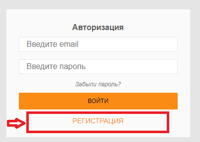
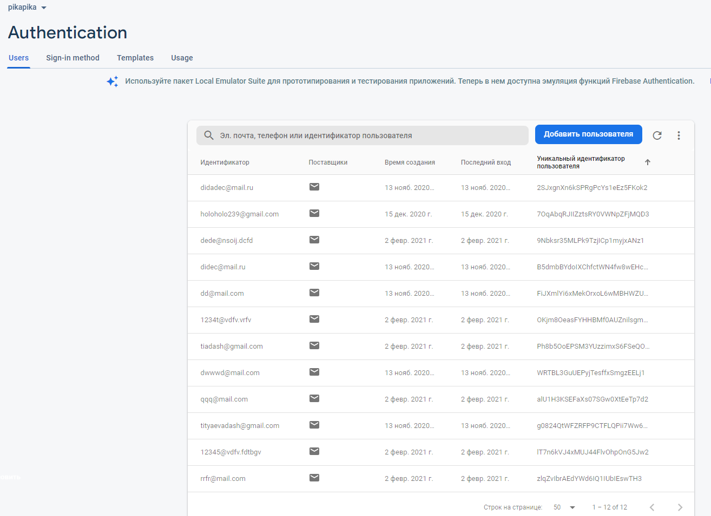
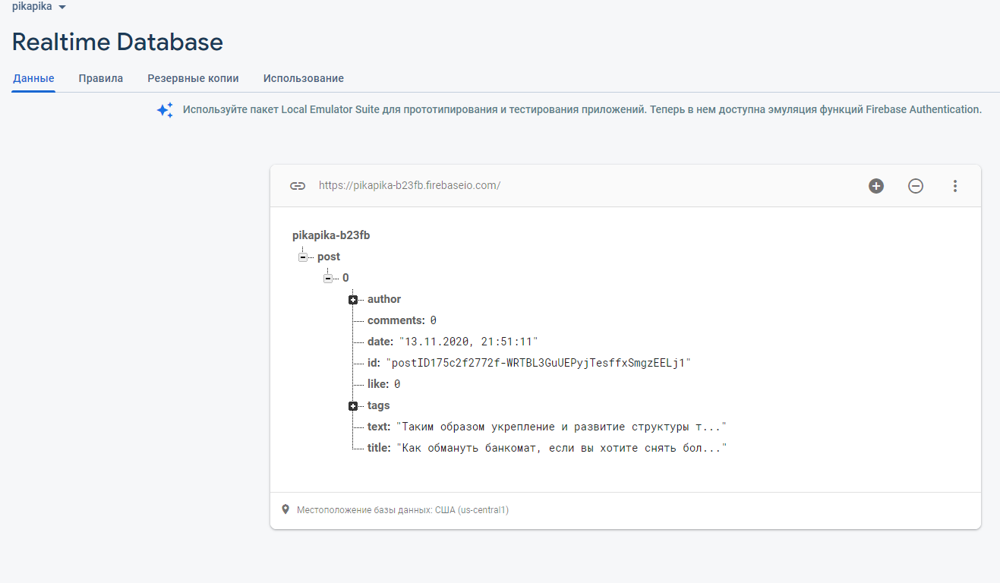
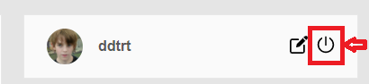
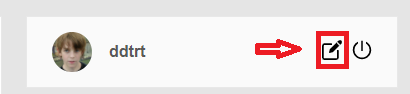
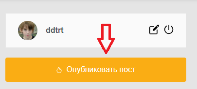

Сайт Pikadu
=====================

Данный сайт предназначен для публикации новостей
---------------------
На данном сайте <https://dashatityaeva.github.io/pikadu/> можно посмотреть готовую верстку. Чтобы опубликовать пост, необходимо пройти регистрацию  или, если вы это уже сделали, авторизоваться повторно.     
`Важно! При регистрации осуществляется валидация через Firebase. Необходимо вводить почту, включающую в себя "@" и ".", а также более длинный и сложный пароль, иначе будет уведомление "Слабый пароль!"` 

`Все ссылки, кнопки и т.д, неописанные ниже, несут только декаративный характер в рамках html-верстки.`

### Используемые технологии: 

* HTML
* CSS
* JS
* Firebase

### Что реализованно:
#### из HTML:
1. _Валидная верстка (проверенно на сайте <https://validator.w3.org/>)_ 
2. _Адаптивная верстка (при помощи media-запросов)_
3. _Семантическая верстка в соответствии с тегами в HTML5_
4. _Кроссбраузерная верстка (Firefox 84, Opera 73, Google Chrome 87, Microsoft Edge 88). В популярных браузерах сайт отображается корректно_
#### из CSS:
1. _Flexbox_
2. _Применение SVG-спрайтов_
#### из JS:
1. _Подключение Firebase:_
    * база данных зарегистрированных людей:

    * база данный в реальном времени опублированных постов:
    
2. _Бургер-меню_
3. _Применение регулярных выражений (для проверки валидности логина при регистрации)_
4. _Реализация выхода и изменение главной страницы для неавторизованного пользователя_  

5. _Реализация редактирования имени и фотограции пользователя_  

6. _Реализация установления имени и фотограции пользователя по умолчанию_  

7. _Реализация создания поста_  

8. _Проверка заголовка и текста поста (не меньше 6 и 60 символов соответственно)_
